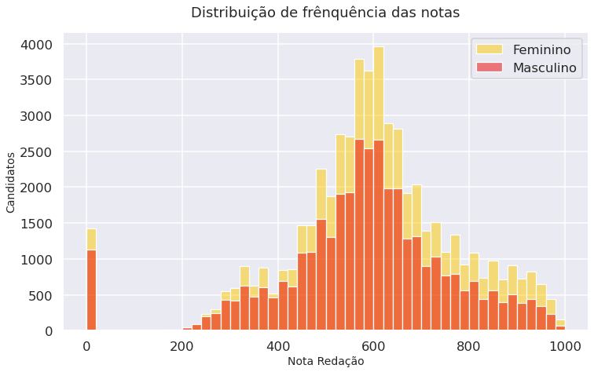

<a href="https://colab.research.google.com/github/ConradBitt/Microdados_ENEM/blob/master/Conrado_Bittencourt.ipynb" target="_parent"></a>

$$\text{A prova de redação e o analfabetismo no Brasil}$$

**Sumário**

1. Introdução 

2. Pre processamento

3. Resultados e Discussões

4. Conclusão

5. Referências

6. Agradecimentos


# 1. Introdução 

Criado em 1998, o Exame Nacional do Ensino Médio (ENEM) é uma das maiores provas do mundo atrás apenas do Gaokao, o vestibular chinês[[1]](https://educacao.estadao.com.br/noticias/geral,aos-20-anos-enem-se-consolida-como-a-maior-prova-do-pais-mas-deve-mudar,70002568288), sendo em muitos casos tão preciso quanto o proprio senso demográfico realizado pelo IBGE, tendo em vista que o ENEM é realizado anualmente. O objetivo desta prova é avaliar o conhecimento dos alunos ao fim do ensino médio. Mas também serve como validação de conhecimento para algumas pessoas que não conseguiram concluir o ensino médio e algumas universidades/faculdades do país adotam a nota do enem como única forma de ingresso. 

Neste projeto será utilizado uma forma pré processada dos microdados do ENEM 2019[[2]](http://portal.inep.gov.br/microdados). Os dados do ENEM são muito ricos, contém mais de 127 mil registros e 136 variáveis. Vou optar por trabalhar apenas com algumas destas variáveis. Os aspectos importantes que serão utilizados neste trabalho são quantos alunos realizaram a prova de redação, se tem mais de 15 anos, algumas características físicas, qual a região do país e a escolaridade dos pais do candidato.

A prova do ENEM é feita em dois dias, o primeiro dia ocorre as provas de ciências humanas, linguagens, códigos, suas tecnologias e a prova de redação. No segundo dia acontecem as avaliações de ciências da natureza, matemática e suas tecnologias. Assim ao verificar a presença do aluno na primeira etapa, podemos garantir que no mínimo ele foi até a sala de aula, excluido assim os alunos que não foram.

A condição para a idade mínima do candidato ser de 15 anos foi escolhida porquê, segundo os dados da Pesquisa Nacional por Amostra de Domicílios (Pnad), o analfabetismo entre pessoas de 15 anos ou mais, pelos critérios do Instituto Brasileiro de Geografia e Estatística (IBGE), não são capazes de ler e escrever nem ao menos um bilhete simples é de 6.6%. [[3]](https://agenciabrasil.ebc.com.br/educacao/noticia/2020-07/taxa-cai-levemente-mas-brasil-ainda-tem-11-milhoes-de-analfabetos)

Outro resultado da Pnad é que, as regiões sul e sudeste tem a menor taxa de analfabetismo, 3.3%, para pessoas com mais de 15 anos. Nas regiões norte e centro-oeste as taxas são de 7.6% e 4.9%, respectivamente. O Nordeste tem o maior percentual de analfabetos, 13,9% e quando se trata de pessoas acima de 60 anos, chega a 32%. A situação fica ainda mais grave quando se trata de candidatos negros aumentando a taxa de analfabetismo em 3,6% entre aqueles com 15 anos ou mais.

Segundo Maria do Rosário Longo Mortatti, professora titular da Universidade Estadual Paulista (Unesp) e também presidente emérita da Associação Brasileira de Alfabetização, ocorre a secundarização do EJA (*Educação de Jovens e Adultos*). Na mesma matéria ela aponta que para um gestor não vale o investimento de jovens e adultos, pois são uma parcela muito pequena. [[4]](https://agenciabrasil.ebc.com.br/educacao/noticia/2019-09/analfabetismo-resiste-no-brasil-e-no-mundo-do-seculo-21)

Ainda na matéria da Agência Brasil, a professora afirma que em certo aspecto gestores preferem investir no ensino de crianças e que "*O ex-ministro (da educação) já falecido Paulo Renato usava muito esse argumento, dizendo ‘vamos concentrar os nossos esforços nas novas gerações. A sucessão geracional se encarregará de eliminar o analfabetismo’. Alguns pesquisadores e jornalistas compartilham essa visão, mas ela é duplamente equivocada*". 

Segundo o Índice de Analfabetismo Funcional (INAF) de 2018, realizado pelo Instituto Paulo Montenegro e pela Ação Educativa. Testes cognitivos aplicados no ano de 2017, em 2.002 pessoas residentes em áreas urbanas e rurais de todo o país verificou que 29% das pessoas podem ser consideradas analfabetas funcionais e que não superam o nível rudimentar de proficiência. Apenas 12% da população é considera “proficiente”.[[5]](https://acaoeducativa.org.br/wp-content/uploads/2018/08/Inaf2018_Relat%C3%B3rio-Resultados-Preliminares_v08Ago2018.pdf)

Partindo destes resultados o objetivo então deste trabalho é verificar se essas proporções se mantém na prova no ENEM, utilizando como critério (discutível) a prova de redação. A prova de redação do ENEM é muito ampla, o tema da redação do ano de 2019 foi ***"Democratização do acesso ao cinema no Brasil"*** e os critérios de avaliação de acordo com as competências[[6]](http://portal.mec.gov.br/ultimas-noticias/418-enem-946573306/81381-conheca-as-cinco-competencias-cobradas-na-redacao-do-enem):

* Competência 1 - Demonstrar domínio da modalidade escrita formal da Língua Portuguesa. 

* Competência 2 - Compreender a proposta de redação e aplicar conceitos das várias áreas de conhecimento para desenvolver o tema, dentro dos limites estruturais do texto dissertativo-argumentativo em prosa.

* Competência 3 - Selecionar, relacionar, organizar e interpretar informações, fatos, opiniões e argumentos em defesa de um ponto de vista.

* Competência 4 - Demonstrar conhecimento dos mecanismos linguísticos necessários para a construção da argumentação.

* Competência 5 - Elaborar proposta de intervenção para o problema abordado, respeitando os direitos humanos.

Pecar em algumas destas competências, segundo o site Guia do Estudante, tem caráter eliminatório para a prova [[7]](https://guiadoestudante.abril.com.br/enem/o-que-pode-zerar-a-nota-de-redacao-do-enem/). Dito isso, as perguntas que estão postas são "*Quantos alunos com mais de 15 anos foram eliminados na prova redação*", "*Qual a idade das pessoas eliminadas?*","*Qual a região onde os candidatos foram mais eliminados?*", "*Qual a proporção entre a cor das pessoas que foram eliminadas?*", "*Qual a escolaridade dos pais do candidato que foi eliminado na prova de redação?*"

# 2. Pre processamento 

Vou selecionar as variáveis importantes para a análise. Como os microdados apresentam 136 variáveis, vou me concentrar em apenas algumas delas.

## 2.1 Variáveis sociais

`SG_UF_RESIDENCIA`: Sigla da unidade federativa

`NU_IDADE`: Idade em número inteiro

`TP_SEXO`: Sexo
* M:	Masculino
* F:	Feminino 


`TP_COR_RACA`: Cor/raça
* 0:	Não declarado
* 1:	Branca
* 2:	Preta
* 3:	Parda
* 4:	Amarela
* 5:	Indígena 


`TP_ST_CONCLUSAO`: Situação de conclusão do Ensino Médio
* 1:	Já concluí o Ensino Médio
* 2:	Estou cursando e concluirei o Ensino Médio em 2019
* 3:	Estou cursando e concluirei o Ensino Médio após 2019
* 4:	Não concluí e não estou cursando o Ensino Médio


`TP_ESCOLA`: Tipo da escola.
* 1: 	Não Respondeu
* 2:	Pública
* 3:	Privada
* 4:	Exterior


`Q001`: Até que série seu pai, ou o homem responsável por você, estudou?
* A	Nunca estudou.
* B	Não completou a 4ª série/5º ano do Ensino Fundamental.
* C	Completou a 4ª série/5º ano, mas não completou a 8ª série/9º ano do Ensino Fundamental.
* D	Completou a 8ª série/9º ano do Ensino Fundamental, mas não completou o Ensino Médio.
* E	Completou o Ensino Médio, mas não completou a Faculdade.
* F	Completou a Faculdade, mas não completou a Pós-graduação.
* G	Completou a Pós-graduação.
* H	Não sei.


`Q002`: Até que série sua mãe, ou a mulher responsável por você, estudou?
* A	Nunca estudou.
* B	Não completou a 4ª série/5º ano do Ensino Fundamental.
* C	Completou a 4ª série/5º ano, mas não completou a 8ª série/9º ano do Ensino Fundamental.
* D	Completou a 8ª série/9º ano do Ensino Fundamental, mas não completou o Ensino Médio.
* E	Completou o Ensino Médio, mas não completou a Faculdade.
* F	Completou a Faculdade, mas não completou a Pós-graduação.
* G	Completou a Pós-graduação.
* H	Não sei.

##  2.2 Variáveis Prova Multipla Escolha

`TP_PRESENCA_CN`: Presença em Ciencia da Natureza

`TP_PRESENCA_CH`: Presença em Ciencias Humanas

`TP_PRESENCA_LC`: Presença em Linguagens e Códigos

`TP_PRESENCA_MT`: Presença em Matemática

Os possíveis valores para estes campos são: 

* 0:	Faltou à prova
* 1:	Presente na prova
* 2:	Eliminado na prova

Essas variáveis são importantes pois quem esta presente no primeiro dia de avaliação no mínimo recebeu a folha de redação para resolve-la. Aqui vale citar que faltar a prova ou ser eliminado não contribui para o estudo, tendo em vista que queremos pessoas que realizaram a prova mas pecaram nas competências exigidas pela prova de redação.

## 2.3 Variáveis Prova Redação 

`TP_STATUS_REDACAO`:Situação da redação do participante
* 1	Sem problemas
* 2	Anulada
* 3	Cópia Texto Motivador
* 4	Em Branco
* 6	Fuga ao tema
* 7	Não atendimento ao tipo textual
* 8	Texto insuficiente
* 9	Parte desconectada

**Obs**: Dentro do dicionário dos microdados não tem o campo de índice nº 5. Por padronização vou optar por não reindexar os campos.

## 2.4 Importações e Carregamento


```python
# importações 
from matplotlib import pyplot as plt 
import matplotlib
import pandas as pd 
import seaborn as sns
import geopandas as gpd 

# Estilos
sns.set_theme()
sns.set_context("talk")

# Carregamentos 
# Carregando mapa
uf_br0 = gpd.read_file('Shapes/gadm36_BRA_0.shp')
uf_br1 = gpd.read_file('Shapes/gadm36_BRA_1.shp')
# Carregando microdados ENEM
raw_dados = pd.read_csv('https://raw.githubusercontent.com/alura-cursos/imersao-dados-2-2020/master/MICRODADOS_ENEM_2019_SAMPLE_43278.csv')

# Informações básicas
print(f'Registros: {len(raw_dados)}\nVariáveis: {len(raw_dados.columns)}')
```

    Registros: 127380
    Variáveis: 136


## 2.5 Seleção de variáveis


```python
# Variaveis sociais 
variaveis_sociais = ['SG_UF_RESIDENCIA', 'NU_IDADE', 'TP_SEXO', 'TP_COR_RACA', 'TP_ST_CONCLUSAO', 'TP_ESCOLA', 'Q001', 'Q002']
variaveis_prova = ['TP_PRESENCA_CN', 'TP_PRESENCA_CH', 'TP_PRESENCA_LC', 'TP_PRESENCA_MT', 'TP_STATUS_REDACAO', 'NU_NOTA_REDACAO']

# idade mínima 
participantes_mais_de_15_anos = raw_dados.query('NU_IDADE >= 15 ')

# se o campo TP_PESENCA_CN == 1, significa que a pessoa estava presente na prova de ciencias da natureza
participantes_mais_de_15_anos = participantes_mais_de_15_anos.query('TP_PRESENCA_CN == 1 & TP_PRESENCA_MT == 1')

# para eliminar registros NaN, uso o dropna()
sifted_data = participantes_mais_de_15_anos[variaveis_sociais + variaveis_prova].dropna()
quantidade_alunos_fizeram_redacao = len(sifted_data)
```

As características computacionais das variáveis e do dataframe são:


```python
sifted_data.info()
```

    <class 'pandas.core.frame.DataFrame'>
    Int64Index: 92420 entries, 0 to 127379
    Data columns (total 14 columns):
     #   Column             Non-Null Count  Dtype  
    ---  ------             --------------  -----  
     0   SG_UF_RESIDENCIA   92420 non-null  object 
     1   NU_IDADE           92420 non-null  int64  
     2   TP_SEXO            92420 non-null  object 
     3   TP_COR_RACA        92420 non-null  int64  
     4   TP_ST_CONCLUSAO    92420 non-null  int64  
     5   TP_ESCOLA          92420 non-null  int64  
     6   Q001               92420 non-null  object 
     7   Q002               92420 non-null  object 
     8   TP_PRESENCA_CN     92420 non-null  int64  
     9   TP_PRESENCA_CH     92420 non-null  int64  
     10  TP_PRESENCA_LC     92420 non-null  int64  
     11  TP_PRESENCA_MT     92420 non-null  int64  
     12  TP_STATUS_REDACAO  92420 non-null  float64
     13  NU_NOTA_REDACAO    92420 non-null  float64
    dtypes: float64(2), int64(8), object(4)
    memory usage: 10.6+ MB


# 4. Resultados e Discussões
## Quantos alunos com mais de 15 anos foram eliminados na prova redação

Como já foi dito anteriormente a prova de redação tem um caráter eliminatório, isso significa que pecar em uma das competências significa não poder entrar em uma universidade/faculdade ou ainda não conseguir tirar um comprovante de conclusão do ensino médio. Dito isso vamos dar uma breve olhada de como se distribuem a nota de redação de todos os candidatos:


```python
plt.figure(figsize=(12,7))
plt.title('Distribuição de frênquência das notas', pad=20, fontsize=18)
ax = sns.histplot(data = sifted_data, x='NU_NOTA_REDACAO', hue='TP_SEXO', palette='hot',bins=50)
ax.legend(['Feminino','Masculino'])
#ax.legend(['Não declarado','Branca','Preta','Parda','Amarela','Indígena'])
ax.set_ylabel('Candidatos', fontsize=14)
ax.set_xlabel('Nota Redação', fontsize=14)
ax = ax
```





Podemos verificar que existe uma diferença entre os sexos masculino e feminino. **A quantidade e a nota de mulheres que fazem o exame é maior que a dos homens**. Este é um resultado de mulheres estudarem mais que homens já é um resultado bem conhecido pelo IBGE [[8]](https://agenciadenoticias.ibge.gov.br/agencia-noticias/2012-agencia-de-noticias/noticias/20234-mulher-estuda-mais-trabalha-mais-e-ganha-menos-do-que-o-homem). 

Olhando para os participantes que tiveram nota zero na redação, podemos ver que mulheres também são mais eliminadas que homens. Mas é uma diferença esperada, na verdade este é um resultado sistematico tendo em vista que mais mulheres fazem o exame.

Podemos verificar a proporção de eliminados na prova de redação do enem 2019: 


```python
eliminados_na_redacao = len(sifted_data.query('NU_NOTA_REDACAO == 0.0'))
proporcao_eliminados_redacao = (len(sifted_data.query('NU_NOTA_REDACAO == 0.0')) / len(sifted_data)) * 100

total_M = len(sifted_data.query('TP_SEXO == "M"'))
total_F = len(sifted_data.query('TP_SEXO == "F"'))

quantidade_M = len(sifted_data.query('TP_SEXO == "M"').query('TP_STATUS_REDACAO != 1.0'))
quantidade_F = len(sifted_data.query('TP_SEXO == "F"').query('TP_STATUS_REDACAO != 1.0'))

print(f'Quantidade de candidatos que realizaram a prova: {quantidade_alunos_fizeram_redacao}')
print(f'Eliminados na redação: {eliminados_na_redacao}')
print(f'Proporção de eliminados: {proporcao_eliminados_redacao:.2f}%')
print(f'\nQuantidade de candidatos do sexo masculino: {quantidade_M}')
print(f'Quantidade de candidatos do sexo feminino: {quantidade_F}')

print(f'\nProporção Homens eliminados: {(quantidade_M / total_M) * 100: .2f}%')
print(f'Proporção Mulheres eliminadas: {(quantidade_F / total_F) * 100: .2f}%')
```

    Quantidade de candidatos que realizaram a prova: 92420
    Eliminados na redação: 2554
    Proporção de eliminados: 2.76%
    
    Quantidade de candidatos do sexo masculino: 1129
    Quantidade de candidatos do sexo feminino: 1425
    
    Proporção Homens eliminados:  3.01%
    Proporção Mulheres eliminadas:  2.59%


Dentre os 92420 candidatos com mais de 15 anos que fizeram a prova de redação do ENEM 2019, a quantidade de pessoas que zeraram a redação e portanto eliminados da prova foi de 2554. A proporção de candidatos eliminados neste quesito é de 2.76%. Também podemos confirmar numéricamente que mulheres fazem mais o exame do que os homens ao passo que, proporcionalmente, **mulheres foram menos desclassificadas na prova de redação nos microdados do ENEM 2019**. 

## Em quais competências que os candidatos mais foram eliminados? 

Nos concentrando nos candidatos que tiraram nota zero, que estão no extremo esquerdo do histograma apresentado anteriormente. Será retirado o rótulo "1: *Sem problemas*" pois indica que não houve nenhum problema de caráter eliminátorio da prova de redação e a maior parte dos candidatos encontra-se nesta situação como foi possível verificar graficamente. Colocá-los em comparação aos alunos que foram eliminados vai provocar distorções no gráfico. Então, analisando somente as competências dos candidatos que foram eliminados na prova de redação: 


```python
competencias = ('Anulada','Cópia Texto Motivador','Em Branco','Fuga ao tema','Não atendimento ao tipo textual','Texto insuficiente','Parte desconectada')

plt.figure(figsize=(15,6))
plt.title("Candidatos desclassificados no ENEM 2019", fontsize= 18, pad=20)
ax = sns.histplot(data = sifted_data.query('NU_NOTA_REDACAO == 0.0'),
                  x = 'TP_STATUS_REDACAO',
                  hue='TP_STATUS_REDACAO',
                  legend=True,
                  palette='plasma')

ax.set_ylabel('Candidatos', fontsize=14)
ax.set_xlabel('', fontsize=14)
ax.legend(competencias[::-1],loc='upper right')
ax.grid(True)
ax = ax
```


Esta é a frequência das competências não antendidas, dentre os candidatos que foram desclassificados. De forma quantitativa, podemos verificar que, dentre os candidatos que tem mais de 15 anos e foram eliminados na prova de redação temos: 


```python
candidatos_eliminados_redacao = sifted_data.query('NU_NOTA_REDACAO == 0.0')['TP_STATUS_REDACAO'].value_counts()
candidatos_eliminados_redacao_norm = sifted_data.query('NU_NOTA_REDACAO == 0.0')['TP_STATUS_REDACAO'].value_counts(normalize=True) * 100
candidatos_eliminados_redacao_norm.round(2)
```


    4.0    34.14
    6.0    27.56
    3.0    19.26
    8.0     6.50
    2.0     4.93
    9.0     4.03
    7.0     3.56
    Name: TP_STATUS_REDACAO, dtype: float64


Ou seja as porcentagens de cada desclassificado de acordo com as competências exigidas pelo ENEM, são: 

* Em Branco:    34.14%
* Fuga ao tema:    27.56%
* Cópia Texto Motivador:    19.26%
* Texto insuficiente:     6.50%
* Anulada     4.93%
* Parte desconectada:     4.03%
* Não atendimento ao tipo textual:    3.56%

Excluindo os 34.14% dos candidatos deixaram a prova em branco, pois não tem como saber como inferir qual seria o motivo da eliminação caso tivesse escrito algo na prova e se concentrando apenas nos outros casos, temos 


```python
print(f'Candidatos que não deixaram a prova em branco e foram eliminados: {candidatos_eliminados_redacao.iloc[1:].sum().round(2)}')
print(f'Proporção de candidatos que não deixaram a prova em branco e foram eliminados: {candidatos_eliminados_redacao_norm.iloc[1:].sum().round(2)}%')
```

    Candidatos que não deixaram a prova em branco e foram eliminados: 1682
    Proporção de candidatos que não deixaram a prova em branco e foram eliminados: 65.86%


65.86% dos candidatos que tem mais de 15 anos e realizaram a prova de redação, pertem ao grupo de candidatos que deixou a desejar em um dos critérios copiar texto motivador, fugir ao tema "*Democratização do acesso ao cinema no Brasil*", não atendimento ao tipo textual (Dissertativo argumentativo), texto insuficiente e parte desconectada.

Suponto este grupo de candidatos, com mais de 15 anos, segundo o INAF 2018 [[5]](https://acaoeducativa.org.br/wp-content/uploads/2018/08/Inaf2018_Relat%C3%B3rio-Resultados-Preliminares_v08Ago2018.pdf) em uma base de 796 avaliados que estão no ensino médio (ou seja mais de 15 anos), 42% estão na categoria "Alfabetização Elementar" cujos critérios de avaliação são: 

* Capaz de selecionar  uma  ou  mais  unidades  de  informação,  observando  certas  condições,  em  textos  diversos  de extensão média realizando pequenas inferências.

* Resolve problemas envolvendo operações básicas com números da ordem do milhar, que exigem certo grau de planejamento e controle (total de uma compra, troco, valor de prestações sem juros).
* Compara  ou  relaciona  informações  numéricas  ou  textuais  expressas  em  gráficos  ou  tabelas  simples, envolvendo situações de contexto cotidiano doméstico ou social.

* Reconhece  significado  de  representação  gráfica  de  direção  e/ou  sentido  de  uma  grandeza  (valores negativos, valores anteriores ou abaixo daquele tomado como referência).

**Então podemos fazer um comparativo entre as métricas do INAF (Índice Nacional de Analfabetismo Funcional), onde 42% dos 796 avaliados com mais de 15 anos estão classificados em "Alfabetização Elementar" e os 65.86% dos 2554 candidatos eliminados por não atender as relativamente parecidas com as especificações exigidas na prova de redação do ENEM**


## Qual a idade das pessoas desclassificadas na redação?

Outro ponto que é abordado na entrevista da Agência Brasil, e uma crítica feita pela professora Maria do Rosário Longo Mortatti é que muitos gestores não investem em educação para jovens e adultos porque esta faixa tem uma proporção menor se comparada com as outras. O grafico a seguir contruido a partir dos nossos dados reflete um pouco desta situação


```python
plt.figure(figsize=(12,7))
plt.title("Distribuição de idades dos candidados desclassificados na prova de redação", fontsize= 18, pad=20)
ax = sns.histplot(data = sifted_data.query('TP_STATUS_REDACAO != 1.0 '), x='NU_IDADE', hue='TP_SEXO', palette='hot')
ax.set_xlabel('Idade', fontsize=14)
ax.set_ylabel('Candidatos', fontsize=14)
ax = ax
```


A quantidade de alunos que foram eliminados na prova de redação é maior entre as pessoas menores de 20 anos. Mas em contraste do que é observado no estudo de taxa de analfabetos no brasil realizado pela PNAD "Quanto maior a idade, maior a taxa de analfabetismo", no ENEM se for usada a métrica da prova de redação para medir a taxa de analfabetismo a quantidade de pessoas mais velhas aparentemente são desclassificadas em uma proporção menor menor que os jovens. 

É importante salientar que o ENEM é uma prova que dura 4 horas e é realizada em dois domingos, tendo isso em mente é razoavavel pensar que mais jovens fazem o exame, portanto esta comparação entre a PNAD e o ENEM não é a mais adequada. Além de vários outros fatores.

Um questionamento totalmente valido é "Será que jovens e adultos estudam menos, porque estão em menor proporção? Ou será que estudam menos por falta de incentivos e oportunidades?". Neste tipo de análise, este questionamento é fundamental, pois se menos jovens e adultos chegam a se candidatar para fazer o exame nacional do ensino médio a inferência de que eles são em menor proporção estará enviesada. 

## Qual a região onde os candidatos foram mais eliminados?

Como já foi dito anteriormente, as regiões sul e sudeste tem a menor taxa de analfabetismo, seguido da região norte e centro-oeste e o local onde ocorre a maior taxa é na região é no nordeste brasileiro. Em partes este resultado pode ser observado também nos dados do ENEM.


```python
# criando o grupo de estados
dados_por_estado_eliminados_redacao = sifted_data.query('TP_STATUS_REDACAO != 1.0').groupby('SG_UF_RESIDENCIA').sum().sort_values('TP_PRESENCA_CN', ascending=False)

# separando dados por estado
dados_candidatos_por_estado = sifted_data.groupby('SG_UF_RESIDENCIA').sum().sort_values('TP_PRESENCA_CN', ascending=False) 
candidatos_normalizados_por_estado = (dados_por_estado_eliminados_redacao['TP_PRESENCA_CN'] /  dados_candidatos_por_estado['TP_PRESENCA_CN']).sort_values(ascending=False)*100

# Informações para o mapa
uf_br1['NAME_1'] = candidatos_normalizados_por_estado.index
uf_br1['NOTA_ENEM_NORMALIZADA'] = candidatos_normalizados_por_estado.values

ax = uf_br1.plot(figsize=(14,6),
                 column='NOTA_ENEM_NORMALIZADA',
                 cmap=matplotlib.cm.get_cmap('gnuplot'),
                 legend=True).set_axis_off()
ax = ax
```


Os lugares onde a cor tem um tom mais violeta representam uma quantidade menor de eliminados na prova de redação, já os estados onde a cor tem um tom mais alaranjado/amarelo tem uma quantidade de maior. Este resultado foi exposto de acordo com a proporção de candidatos de cada estado e é possível verificar que **a quantidade de pessoas que são desclassificadas na prova de redação é menor nas regiões sul e sudeste se comparadas com norte e nordeste.**


```python
# gerando o grafico
plt.figure(figsize=(15,6))
plt.title('Eliminados na prova de redação em proporção com nº de candidatos do estado', fontsize=18, pad=20)
ax = sns.barplot(y = candidatos_normalizados_por_estado[::-1],
                 x = candidatos_normalizados_por_estado.index[::-1],
                 palette='gnuplot')
ax.set_ylabel('(%) Candidatos Desclassificados', fontsize=14)
ax.set_xlabel('Sigla do Estado', fontsize=14)

ax = ax
```


Note que na região mais violeta, quem tem a menor quantidade de candidatos desclassificados pela redação, são majoritariamente estados da região sul e sudeste. Já **os estados que tem uma maior proporção de eliminados são Roraima, Ceará e Amazonas**.

Como já foi dito anteriormente, nas regiões sul e sudeste tem a menor taxa de analfabetismo, 3.3%, para pessoas com mais de 15 anos. No ENEM coincidentemente os estados que tem a menor taxa de desclassificação proporcionalmente ao numero de candidatos do estado são justamente os que fazem parte da região sul e sudeste.

**Podemos dizer estes resultados encontrados concordam em parte com resultados de analfabetismo por estados encontrado pela PNAD 2019. Digo em parte porque, novamente, o ENEM é realizado anualmente e nesta base de microdados temos 127 mil registros.**

## Qual a proporção entre a cor/raça das pessoas que foram eliminadas?

Vamos ver a distribuição da nota de redação dos candidatos:


```python
ax = sns.displot(data = sifted_data.query('TP_COR_RACA != [0,4,5]'), x='NU_NOTA_REDACAO',
                 col='TP_COR_RACA', hue='TP_COR_RACA', palette='Set1', bins=50,
                 alpha=0.9).set_xlabels('Nota').set_titles('')
ax = ax
```


O grafico acima mostra a distribuição de notas de acordo com a cor/raça. Em vermelho temos as pessoas que marcaram a cor/raça "branca", em azul as pessoas que marcaram "preta" e verde os candidatos que marcaram "parda". Optei por remover os candidatos que marcaram "Não responderam", "Amarelos" e "Indigena", porque as quantidades são muito pequenas nesta base de dados.

Analisando as pessoas que foram desclassificadas na prova de redação (no extremo esquerdo) de cada figura, vemos que a quantidade de pardos é a maior, seguida da quantidade de brancos e por fim negros, mas a quantidade de candidatos em cada uma das classificações também é diferentes. 


```python
total_candidatos = sifted_data.query('TP_COR_RACA == [1,2,3]').groupby('TP_COR_RACA').sum()['TP_PRESENCA_LC']
eliminados_redacao = sifted_data.query('TP_COR_RACA == [1,2,3] & NU_NOTA_REDACAO == 0.0').groupby('TP_COR_RACA').sum()['TP_PRESENCA_LC']
proporcao_de_eliminados = (eliminados_redacao/total_candidatos)

print((proporcao_de_eliminados*100).round(2))
```

    TP_COR_RACA
    1    1.91
    2    3.24
    3    3.28
    Name: TP_PRESENCA_LC, dtype: float64


Numericamente temos que a proporção de brancos eliminados é de 1.91%, pretos 3.24% e pardos 3.28%. Apesar desta classificação qualitativa entre pretos e pardos ser bem discutível, é inegavel que a maior parte das pessoas que zeram né de negros/pardos se comparado com a proporção de brancos. 

**Se levarmos em conta o dado do analfabetismo, dito anteriormente que brancos tem uma taxa menor de analfabetismo se comparado com pessoas negras, no ENEM isso também acontece com pessoas pessoas que foram eliminadas na prova de redação**.

Fazendo um comparativo com a primeira análise, onde ocorre que mais mulheres fazem o exame nacional e proporcionalmente são menos desclassificadas que homens na prova de redação, na analise de cor/raça isso não acontece. Porporcionalmente, mais pretos e pardos são desclassificados se comparados com os candidatos que marcaram cor/raça "branca" no questionario.


```python
abs((proporcao_de_eliminados.iloc[0] - proporcao_de_eliminados.iloc[1]) * 100).round(2)
```


    1.33


De acordo com a pesquisa da PNAD,a taxa de analfabetismo entre negros é 3.6% maior em negros do que em brancos. Na prova de redação do ENEM essa diferença de proporções é de 1.33% se comprar apenas brancos e pretos.

## Qual a escolaridade dos pais do candidato que foi eliminado na prova de redação?


```python
# agrupando quem zerou na redação por escolaridade dos pais
escolaridade_pai_desclassificado = sifted_data.query('TP_STATUS_REDACAO != 1.0').groupby('Q001').sum()
escolaridade_mae_desclassificado = sifted_data.query('TP_STATUS_REDACAO != 1.0').groupby('Q002').sum()
```


```python
plt.figure(figsize=(12,5))
plt.title("Escolaridade do pai dos candidatos desclassificados no ENEM", fontsize= 18, pad=20)
ax = sns.barplot(data = escolaridade_pai_desclassificado,
                  y = 'TP_PRESENCA_CN',
                  x=escolaridade_pai_desclassificado.index,
                 
                  palette='plasma')

ax.set_ylabel('Candidatos', fontsize=14)
ax.set_xlabel('', fontsize=14)
ax = ax
```


Os rótulos de cada letra são: 
* A	Nunca estudou.
* B	Não completou a 4ª série/5º ano do Ensino Fundamental.
* C	Completou a 4ª série/5º ano, mas não completou a 8ª série/9º ano do Ensino Fundamental.
* D	Completou a 8ª série/9º ano do Ensino Fundamental, mas não completou o Ensino Médio.
* E	Completou o Ensino Médio, mas não completou a Faculdade.
* F	Completou a Faculdade, mas não completou a Pós-graduação.
* G	Completou a Pós-graduação.
* H	Não sei.

Neste gráfico dois resultados me chamaram a atenção. Visualmente, a maior parte dos pais destes candidatos que não atigiram as competências exigidas pela avaliação de redação do ENEM, não completou a 4ª série/5º ano do Ensino Fundamental e a quarta categoria (H), onde o candidato informou "Não sei". Existem varias possibilidades pra não saber a escolaridade do pai, de qualquer forma, é um dado que me chamou a atenção.

Analisando a proporção desses resultados em ordem decrescente:


```python
total_candidatos = escolaridade_pai_desclassificado['TP_PRESENCA_CN'].sum()
escolaridade_pai_ordem = ((escolaridade_pai_desclassificado['TP_PRESENCA_CN'] / total_candidatos )  * 100).round(2).sort_values(ascending=False)
escolaridade_pai_ordem
```


    Q001
    B    25.88
    E    20.32
    C    15.27
    H    12.18
    A    10.85
    D    10.38
    F     3.52
    G     1.61
    Name: TP_PRESENCA_CN, dtype: float64


A maior parte dos candidatos encontra-se na categoria **B** (*25.88%, Não completou a 4ª série/5º ano do Ensino Fundamental.*), em segundo temos a categoria **E** (*20.34%, Completou o Ensino Médio, mas não completou a Faculdade*), em terceiro temos categoria temos **C** onde o pai do candidato completou a 4ª série/5º ano, mas não completou a 8ª série/9º ano do Ensino Fundamental.

Podemos concluir que dentre os candidatos que foram desclassificados na prova de redação o pai não frequentou a faculdade. Verificando a escolaridade da mãe temos: 


```python
plt.figure(figsize=(12,5))
plt.title("Escolaridade da mãe dos candidatos desclassificados no ENEM", fontsize= 18, pad=20)
ax = sns.barplot(data = escolaridade_mae_desclassificado,
                  y = 'TP_PRESENCA_CN',
                  x = escolaridade_mae_desclassificado.index,
                 
                  palette='plasma')

ax.set_ylabel('Candidatos', fontsize=14)
ax.set_xlabel('', fontsize=14)
ax = ax
```


* A	Nunca estudou.
* B	Não completou a 4ª série/5º ano do Ensino Fundamental.
* C	Completou a 4ª série/5º ano, mas não completou a 8ª série/9º ano do Ensino Fundamental.
* D	Completou a 8ª série/9º ano do Ensino Fundamental, mas não completou o Ensino Médio.
* E	Completou o Ensino Médio, mas não completou a Faculdade.
* F	Completou a Faculdade, mas não completou a Pós-graduação.
* G	Completou a Pós-graduação.
* H	Não sei.


```python
total_candidatos = escolaridade_mae_desclassificado['TP_PRESENCA_CN'].sum()
escolaridade_mae_ordem = ((escolaridade_mae_desclassificado['TP_PRESENCA_CN'] / total_candidatos )  * 100).round(2).sort_values(ascending=False)
escolaridade_mae_ordem
```


    Q002
    E    27.96
    B    20.95
    C    15.00
    D    14.41
    A     7.75
    H     5.52
    F     5.05
    G     3.37
    Name: TP_PRESENCA_CN, dtype: float64


Podemos notar que a primeira categoria **E**, onde a mãe do candidato completou o Ensino Médio, mas não completou a Faculdade. Como já foi dito anteriormente este é um resultado conhecido pelo IBGE [[8]](https://agenciadenoticias.ibge.gov.br/agencia-noticias/2012-agencia-de-noticias/noticias/20234-mulher-estuda-mais-trabalha-mais-e-ganha-menos-do-que-o-homem), mulheres estudam mais que homens e comparando com a proporção anterior podemos verificar isto. A segunda categoria vem o grupo onde a mãe não completou a 4ª série/5º ano do Ensino Fundamental seguida da categoria C em que a mãe completou a 4ª série/5º ano, mas não completou a 8ª série/9º ano do Ensino Fundamental.

Podemos verificar se estes resultados se mantém em relação ao total de candidatos do ENEM:


```python
# agrupando quem zerou na redação por escolaridade dos pais
escolaridade_pai_desclassificado = sifted_data.groupby('Q001').sum()
escolaridade_mae_desclassificado = sifted_data.groupby('Q002').sum()

#escolaridade do pai 
total_candidatos = escolaridade_pai_desclassificado['TP_PRESENCA_CN'].sum()
escolaridade_pai_ordem = ((escolaridade_pai_desclassificado['TP_PRESENCA_CN'] / total_candidatos )  * 100).round(2).sort_values(ascending=False)
print('Escolaridade do Pai\n',escolaridade_pai_ordem)

#escolaridade da mãe
total_candidatos = escolaridade_mae_desclassificado['TP_PRESENCA_CN'].sum()
escolaridade_mae_ordem = ((escolaridade_mae_desclassificado['TP_PRESENCA_CN'] / total_candidatos )  * 100).round(2).sort_values(ascending=False)
print('\nEscolaridade do Mãe\n',escolaridade_mae_ordem)
```

    Escolaridade do Pai
     Q001
    E    27.39
    B    20.34
    C    13.67
    D    11.78
    F     8.27
    H     8.24
    G     5.22
    A     5.10
    Name: TP_PRESENCA_CN, dtype: float64
    
    Escolaridade do Mãe
     Q002
    E    33.39
    B    14.83
    D    12.89
    C    12.72
    F    11.17
    G     9.04
    A     3.31
    H     2.66
    Name: TP_PRESENCA_CN, dtype: float64


Note que 33.39% das mães dos candidatos tem completou o ensino médio mas não frequentou a faculdade ao passo que apenas 27.39% dos pais dos candidatos se encontram nesta categoria.

Estes resultados são importantes tanto na base de microdados que envolve todos os candidatos tanto quanto apenas os candidatos eliminados na prova de redação. **Um trabalho chamado [*Seleção de características para predição de notas no ENEM 2018*](https://youtu.be/OIvkeEn-c3Q?t=7475), apresentado pela Kizzy Terra no IMPA, mostrou um resultado interessante: a escolaridade da mãe é um fator que aparentemente contribui para "a aprovação do candidato" em uma universidade.**

É importante que salientar que estes resultados obviamente não são deterministicos, mas não da pra negar que estes fatores sociais influenciam em desempenho de alunos que realizam provas longas como o ENEM. Além de, por exemplo, pessoas que ficam nervosas ao fazer provas, candidatos que tiveram um dia ruim, enfim, existem varios fatores externos que podem prejudicar um candidato numa prova.

# Conclusão

Os resultados apresentados até aqui não são extremamente detalhistas, mas podem dar uma boa base para pesquisas mais elaboradas. Mostramos aqui que a quantidade de mulheres que fazem o ENEM é maior do que homens entretanto e que **a quantidade de mulheres que são eliminadas na prova de redação é proporcionalmente menor que a de homens**. 

Um resultado que foi dito na matéria da Agência Brasil é que, o analfabetismo nas regiões norte e nordeste é maior do que nas regiões sul e sudeste. **Este resultado também se reflete no número de desclassificados na prova de redação do ENEM 2019**. A partir deste resultado podem ser pautadas medidas de incentivo regional a respeito da escolarização da educação das pessoas. 

Além disso também vimos que **candidatos mais novos, abaixo de 25 anos, são mais desclassificados que os mais velhos**. Mas como já foi dito anteriormente, proporcionalmente pessoas mais velhas não fazem a prova do ENEM. Um ponto importante a ser citado é que a prova do enem dura 4 horas e não são muitas pessoas que conseguem realizar uma prova dessa dois dias seguidos. **A proporção de jovens e adultos ser menor, não pode ser uma justificativa para não investir em educação para este grupo**, como a professora Maria do Rosário Longo Mortatti denuncia na matéria da Agência Brasil.

É possível que jovens e adultos com menos preparo não se sintam confiantes de se inscrever na prova. **De qualquer forma neste aspecto a análise é inconclusiva, mas pode servir de base para trabalhos futuros a fim de incentivar políticas publicas de inclusão.**

Por fim, a **baixa escolaridade dos pais é um fator que esta presente tanto nos grupo de desclassificados na prova de redação quanto em todo o grupo de candidatos. Entretanto ela é mais proeminente nos grupos que foram eliminados na prova de redação**. Este pode ser um dado reforça ainda a necessidade de alfabetização tanto de jovens quanto de adultos.

# Referências

[1] [Estadão: Aos 20 anos ENEM se consolida como a maior prova do país](https://educacao.estadao.com.br/noticias/geral,aos-20-anos-enem-se-consolida-como-a-maior-prova-do-pais-mas-deve-mudar,70002568288)

[2] [Portal INEP: Microdados do ENEM](http://portal.inep.gov.br/microdados)

[3] [Agência Brasil: Analfabetismo cai, mas Brasil ainda tem 11 milhões sem ler e escrever ](https://agenciabrasil.ebc.com.br/educacao/noticia/2020-07/taxa-cai-levemente-mas-brasil-ainda-tem-11-milhoes-de-analfabetos)

[4] [Agência Brasil: Analfabetismo resiste no Brasil e no mundo do século 21](https://agenciabrasil.ebc.com.br/educacao/noticia/2019-09/analfabetismo-resiste-no-brasil-e-no-mundo-do-seculo-21)

[5] [Indicador de Analfabetismo Funcional 2018 ](https://acaoeducativa.org.br/wp-content/uploads/2018/08/Inaf2018_Relat%C3%B3rio-Resultados-Preliminares_v08Ago2018.pdf)

[6] [Portal MEC: Conheça as cinco competências cobradas na redação do Enem ](http://portal.mec.gov.br/ultimas-noticias/418-enem-946573306/81381-conheca-as-cinco-competencias-cobradas-na-redacao-do-enem)

[7] [Guia Estudante: O que pode zear a prova de redação ENEM](https://guiadoestudante.abril.com.br/enem/o-que-pode-zerar-a-nota-de-redacao-do-enem/)

[8] [Agência IBGE: Mulher estuda mais, trabalha mais e ganha menos do que o homem ](https://agenciadenoticias.ibge.gov.br/agencia-noticias/2012-agencia-de-noticias/noticias/20234-mulher-estuda-mais-trabalha-mais-e-ganha-menos-do-que-o-homem). 

[9] [Github onde encontrei o Shapefile do brasil](https://github.com/MRobalinho/GeoPandas_Brasil/blob/master/Python/Test%20GeoPandas%20with%20Brazil%20States.ipynb)

[10] [Trabalho da Kizzy Torres: Seleção de características para predição de notas no ENEM 2018](https://www.youtube.com/watch?v=OIvkeEn-c3Q)

[11] [Matplotlib ](https://matplotlib.org/)

[12] [Pandas](https://pandas.pydata.org/)

[13] [GeoPandas](https://geopandas.org/)

[14] [Seaborn](https://seaborn.pydata.org/)

[15] [Python](https://www.python.org/)

[16] [Project Jupyter](https://jupyter.org/)

[17] [Google Colab](https://colab.research.google.com/)

# 6. Agradecimentos 

Quero agradecer a [Alura](https://www.alura.com.br/) por incentivar a educação, a tecnologia e o aperfeiçoamento profissional de varias pessoas no nível nacional e internacional, e também por oferecer a Segunda edição da Imersão Dados. Agradeço os amigos e familiares, por me aguentarem falando de python e física, em especial a minha mãe, por revisar este trabalho. Por fim, agradeço as referências, pois tornaram esta breve pesquisa possível.
